# Church Booking System Diagrams and Algorithms

This document presents the system analysis of the church reservation and management platform based on the current project source code. It is written in a formal style suitable for academic or documentation use.

## How to Use This Document

1. Copy the diagram sections into your report or thesis chapter.
2. If your word processor supports Mermaid, paste the diagram blocks directly.
3. If Mermaid is not supported, convert each diagram into an image using a Mermaid renderer and insert the images into `Diagrams.docx`.
4. Use the algorithm, pseudocode, and notes sections as the written explanation below the diagrams.
5. Keep the diagram titles in your final document so each figure is clearly labeled.

## 1) Use Case Diagram

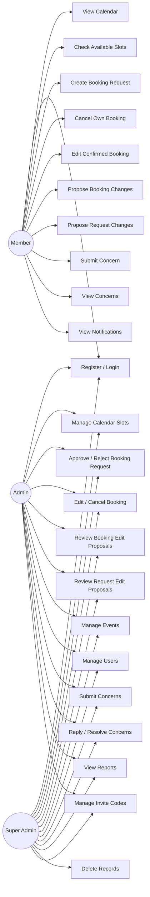

## 2) Activity Diagram

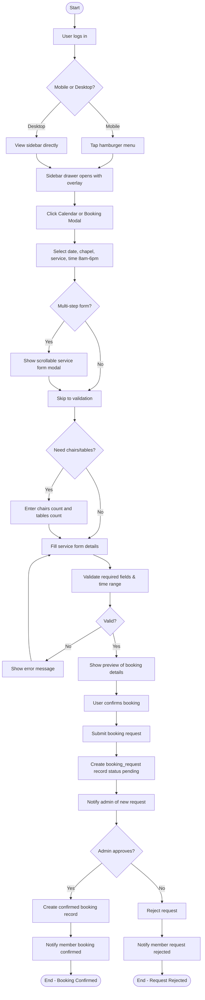

## 3) Gantt Chart - Project Timeline

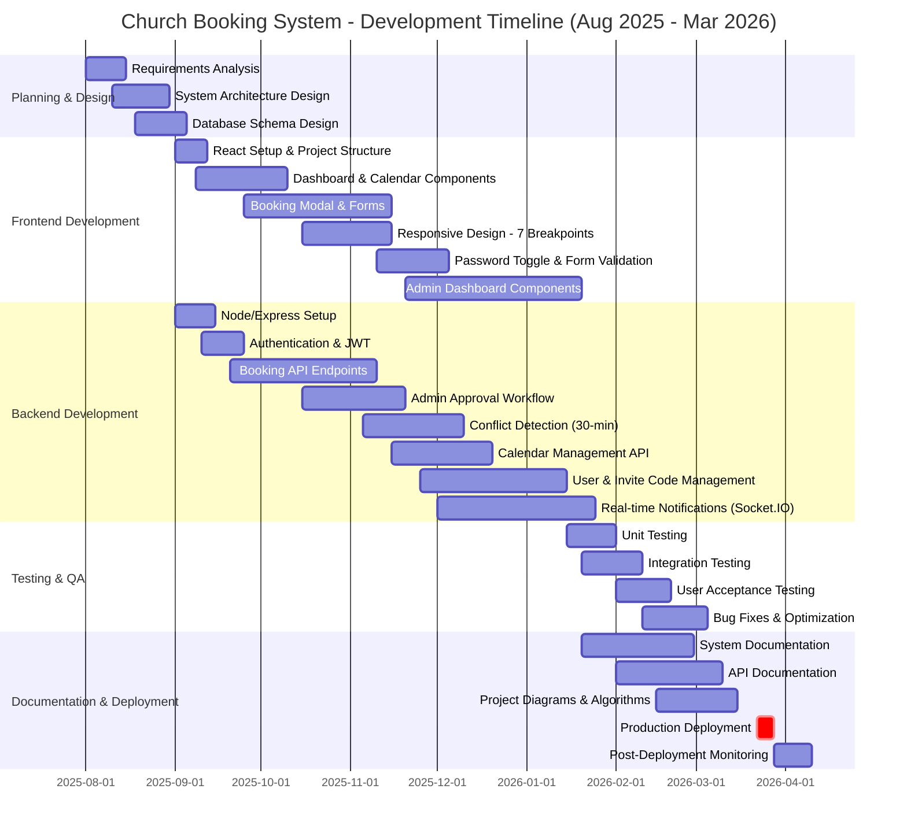

## 4) Booking Process Flowchart

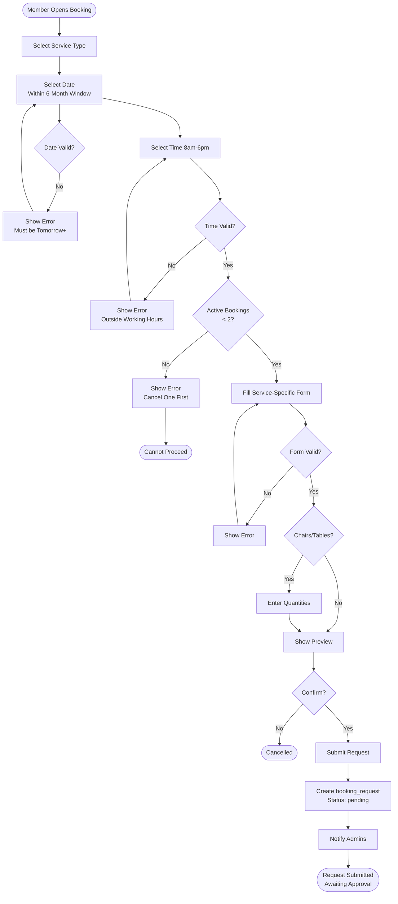

## 5) System Architecture Diagram

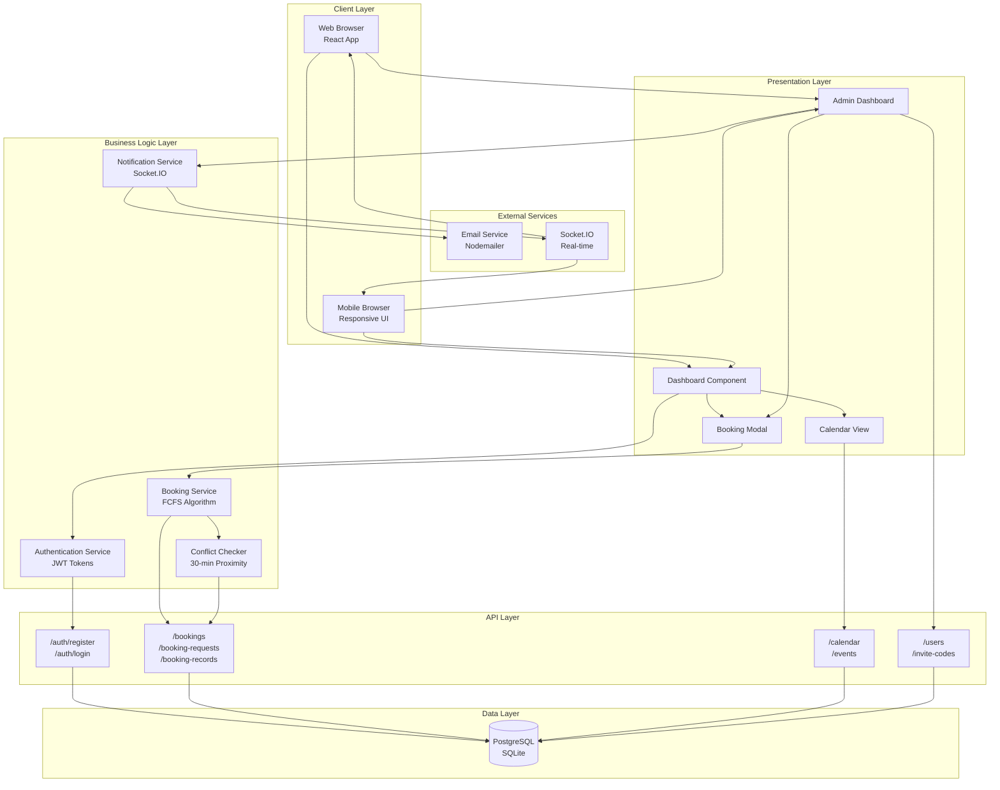

## 6) Control Structure Diagram

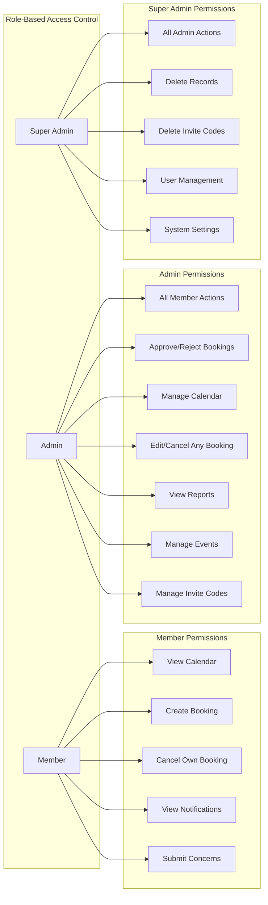

## 7) Sequence Diagram

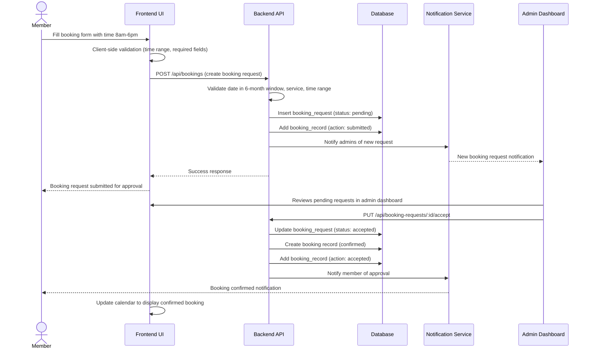

## 8) Entity Relationship Diagram

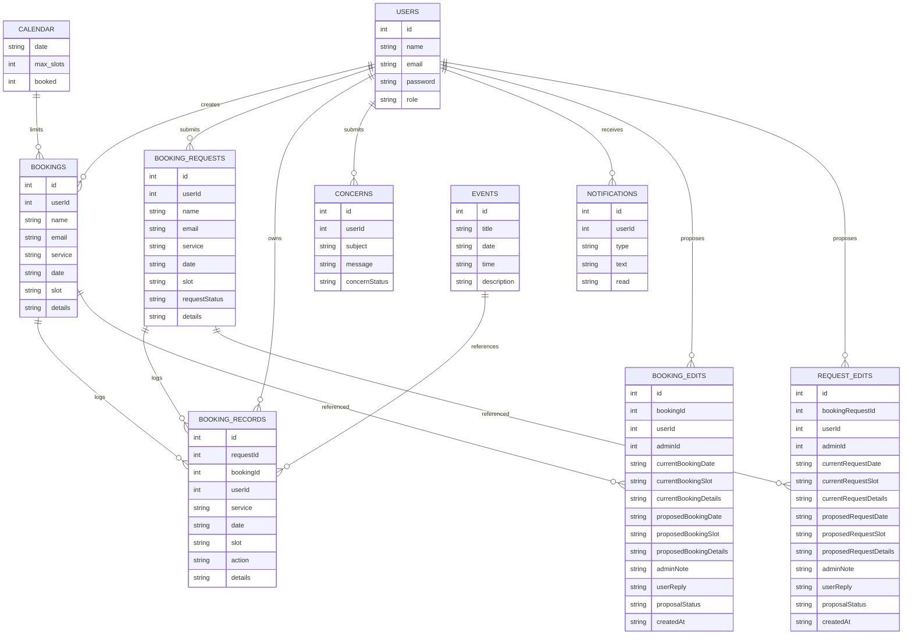

## 9) Class Diagram

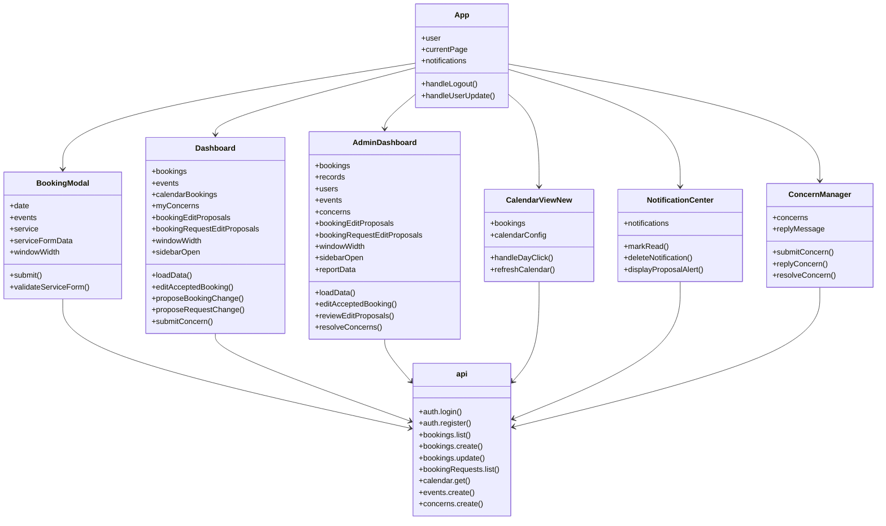

## 10) Deployment Diagram

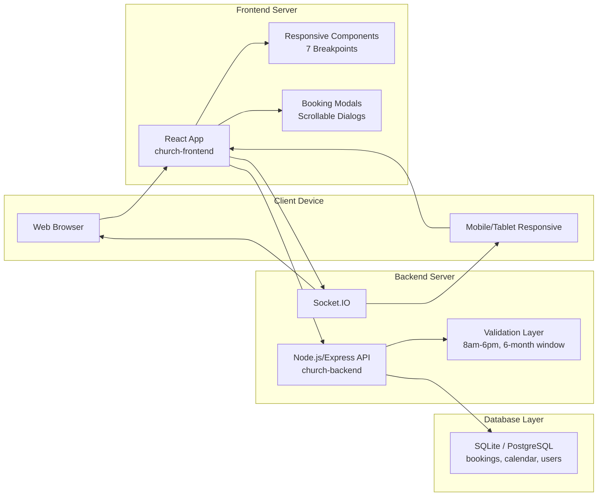

## 11) Algorithmic Process

### A. FCFS Algorithm

1. Accept booking requests in the order they are submitted.
2. Validate the slot, service, and required details.
3. Store valid requests in the booking requests table.
4. Process the earliest pending request first.
5. Check whether the selected date still has available capacity.
6. For exclusive services, verify that the slot is still free.
7. Move approved requests into the confirmed bookings table.
8. Update the calendar booked count.
9. Record the action in booking records.
10. Notify the user and administrator.

### B. Conflict Checker Algorithm

1. When approving a booking request, check for conflicts with existing bookings.
2. Query bookings on the same date where the time difference is less than or equal to 30 minutes.
3. Also check other pending requests for the same date and time proximity.
4. If any conflicts are found, display them to the admin.
5. Admin can choose to approve anyway or reject the request.
6. If approved, create the booking and update records.
7. Notify the member of the approval or rejection.

### C. Date Availability Control Algorithm

1. Admin selects a date in the calendar control panel.
2. Admin sets the maximum booking count for that date.
3. If the maximum count is zero, close the date for bookings.
4. If the maximum count is greater than zero, open the date for bookings.
5. Save the value to the calendar table.
6. Refresh the calendar to show the new availability state.
7. Prevent booking submission when the date is closed or full.

## 12) Pseudocode

### A. FCFS Algorithm

```text
BEGIN
  RECEIVE booking requests in submission order
  FOR each pending request
    VALIDATE slot, service, and required details
    IF request is valid AND date has capacity THEN
      APPROVE request
      MOVE request to confirmed bookings
      UPDATE calendar booked count
      LOG action in booking records
      NOTIFY user and admin
      STOP processing if only one request is being approved
    ENDIF
  END FOR
END
```

### B. Conflict Checker Algorithm

```text
BEGIN
  INPUT: booking request with date and time
  
  FIND all existing bookings on same date
  FOR each booking on same date
    CALCULATE time difference in minutes
    IF ABS(time_difference) <= 30 THEN
      ADD to conflicts list
    ENDIF
  END FOR
  
  FIND all pending requests on same date
  FOR each pending request on same date
    CALCULATE time difference in minutes
    IF ABS(time_difference) <= 30 THEN
      ADD to conflicts list
    ENDIF
  END FOR
  
  IF conflicts list is not empty THEN
    DISPLAY conflicts to admin
    WAIT for admin decision (approve anyway or reject)
  ELSE
    PROCEED with booking approval
  ENDIF
END
```

### C. Date Availability Control Algorithm

```text
BEGIN
  ADMIN selects a date
  ADMIN enters max booking count
  IF max booking count = 0 THEN
    CLOSE date for bookings
  ELSE
    OPEN date for bookings
  ENDIF
  SAVE max booking count in calendar table
  REFRESH calendar display
END
```

## 13) Algorithms

### A. FCFS Algorithm

- Input: booking requests, request order, date capacity
- Output: approved request in first-come-first-served order

Steps:
1. Receive booking requests in the order they are submitted.
2. Validate each request before storage.
3. Queue valid requests as pending.
4. Select the earliest pending request first.
5. Approve it only if the date still has available capacity.
6. Record the approved booking and log the action.

### B. Conflict Checker Algorithm

- Input: booking request with date and time slot
- Output: list of conflicting bookings/requests within 30-minute proximity

Steps:
1. Query all existing bookings on the requested date.
2. For each booking, calculate the absolute time difference in minutes.
3. If any booking has a time difference of 30 minutes or less, add to conflicts.
4. Query all pending requests on the requested date.
5. For each pending request, calculate the absolute time difference in minutes.
6. If any request has a time difference of 30 minutes or less, add to conflicts.
7. If conflicts exist, display them to admin with options to approve anyway or reject.
8. If no conflicts, proceed with booking approval.

### C. Date Availability Control Algorithm

- Input: selected date, max booking count
- Output: open or closed availability state

Steps:
1. Admin selects a date in the calendar settings panel.
2. Admin enters the maximum allowed booking count.
3. If the count is zero, set the date to closed.
4. If the count is greater than zero, set the date to open.
5. Save the updated setting to the calendar table.
6. Re-render the calendar to reflect the new state.

## 14) Core Business Algorithms

### A. Booking Request Submission & Approval Flow

```text
BEGIN
  MEMBER inputs booking form (date, service, time, details)
  
  VALIDATE date in 6-month window AND time in 8am-6pm AND service details
  IF validation fails THEN
    REJECT with error message
    STOP
  ENDIF
  
  CHECK booking limit (active count <= BOOKING_LIMIT=2)
  IF user exceeds limit THEN
    REJECT with error "Limit reached, cancel one first"
    STOP
  ENDIF
  
  CHECK calendar max_slots for selected date
  IF max_slots <= 0 THEN
    REJECT with error "This date is closed for bookings"
    STOP
  ENDIF
  
  IF all validations pass THEN
    INSERT booking_request with status='pending'
    INSERT booking_record with action='submitted'
    NOTIFY all admins of new request
    RETURN success: "Booking request submitted for admin verification"
  ENDIF
  
  ADMIN reviews request in admin dashboard
  
  WHEN admin accepts request:
    UPDATE booking_request status='accepted'
    INSERT new booking record (confirmed)
    INSERT booking_record with action='accepted'
    NOTIFY member: "Your booking has been confirmed"
    CALENDAR updates to show confirmed booking
  
  WHEN admin rejects request:
    UPDATE booking_request status='rejected'
    INSERT booking_record with action='rejected'
    NOTIFY member: "Your booking request was declined"
END
```

### B. Time Validation (8:00 AM - 6:00 PM, Any Minute)

```text
BEGIN
  INPUT: user selected time as HH:MM format
  PARSE hours and minutes from time string
  MINIMUM_HOUR = 8 (8:00 AM)
  MAXIMUM_HOUR = 18 (6:00 PM, boundary)
  
  IF hours >= MINIMUM_HOUR AND hours < MAXIMUM_HOUR THEN
    ACCEPT time (any minute allowed: 8:15, 2:47, etc.)
  ELSE IF hours = 18 AND minutes = 0 THEN
    ACCEPT time (exactly 6:00 PM boundary case)
  ELSE
    REJECT time with error
    Display: "Time must be between 8:00 AM and 6:00 PM"
  ENDIF
END
```

### C. Calendar Navigation (6-Month Dynamic Window)

```text
BEGIN
  TODAY = current date
  EARLIEST_VALID_DATE = TODAY + 1 day (tomorrow)
  LATEST_VALID_DATE = TODAY + 6 months
  
  WHEN user clicks "Previous Month" button:
    CURRENT_MONTH = CURRENT_MONTH - 1 month
    IF CURRENT_MONTH < EARLIEST_VALID_DATE THEN
      DISABLE previous button (opacity: 0.5, pointer-events: none)
    ELSE
      ENABLE previous button
    ENDIF
  
  WHEN user clicks "Next Month" button:
    CURRENT_MONTH = CURRENT_MONTH + 1 month
    IF CURRENT_MONTH > LATEST_VALID_DATE THEN
      DISABLE next button (opacity: 0.5, pointer-events: none)
    ELSE
      ENABLE next button
    ENDIF
  
  WHEN user selects date:
    IF selected_date < EARLIEST_VALID_DATE THEN
      REJECT with error "Cannot book past or today's date"
    ELSE IF selected_date > LATEST_VALID_DATE THEN
      REJECT with error "Can only book up to 6 months in advance"
    ELSE
      ACCEPT date
    ENDIF
END
```

### D. Mobile Responsive Layout Algorithm

```text
BEGIN
  INITIALIZE windowWidth = window.innerWidth
  ADD resize event listener to window
  
  DEFINE BREAKPOINTS = [390, 420, 520, 600, 680, 900, 1920]
  
  ON window resize OR component mount:
    windowWidth = window.innerWidth
    
    IF windowWidth <= 900 THEN
      SET sidebar mode = "drawer"
      SET hamburger button = visible
      SET left column position = fixed, z-index: 990
      SET left column transform = translateX(-105%)
      
      WHEN user clicks hamburger:
        SET sidebar drawer state = open
        LEFT column transform = translateX(0)
        ADD overlay backdrop with z-index 980
        SET body overflow = hidden (prevent scroll)
        ADD body class "sidebar-drawer-open"
      
      WHEN user clicks overlay OR back button:
        SET sidebar drawer state = closed
        LEFT column transform = translateX(-105%)
        REMOVE body class "sidebar-drawer-open"
        SET body overflow = auto
    ELSE
      SET sidebar mode = "fixed" (always visible)
      SET hamburger button = hidden
      SET left column position = relative
    ENDIF
    
    IF windowWidth <= 600 THEN
      SET main grid = 1 column
      SET modal width = min(100vw - 16px, 480px)
      SET modal padding = 8-12px
      SET font size = 11-13px (scale down)
    ELSE IF windowWidth <= 900 THEN
      SET main grid = 1 column
      SET modal width = min(100vw - 20px, 500px)
      SET modal padding = 12-16px
      SET font size = 12-14px
    ELSE
      SET main grid = 2 columns (repeat(2, 1fr))
      SET modal width = 500px
      SET modal padding = 20-24px
      SET font size = 14-16px
    ENDIF
  END
END
```

## 15) Mobile Responsive Design Patterns

### Scrollable Container Pattern (Flexbox with Overflow)

The system uses a critical pattern for handling overflow in modals and scrollable areas:

```css
.scrollable-content {
  flex: 1;
  min-height: 0;  /* Critical: allows flex shrink below content height */
  overflow-y: auto;
  overflow-x: hidden;
}

.fixed-footer {
  flex-shrink: 0;  /* Prevents buttons from shrinking */
  padding: 12px;
  border-top: 1px solid rgba(0, 0, 0, 0.1);
}
```

**Why This Works:** The `min-height: 0` is essential for flexbox overflow to work correctly. Without it, the flex child won't shrink below its content height, causing overflow problems.

**Applied To:**
- BookingModal service form (scrollable form with fixed buttons)
- Dashboard sidebar contact card (scrollable within sidebar)
- AdminDashboard report sections (scrollable content areas)

### Mobile Drawer Pattern (Fixed Overlay)

```css
.drawer-overlay {
  position: fixed;
  top: 0;
  left: 0;
  width: 100%;
  height: 100%;
  background: rgba(0, 0, 0, 0.4);
  z-index: 980;
  opacity: 0;
  pointer-events: none;
  transition: opacity 0.3s ease;
}

.drawer-overlay.open {
  opacity: 1;
  pointer-events: auto;
}

.sidebar {
  position: fixed;
  top: 0;
  left: 0;
  height: 100vh;
  width: 280px;
  z-index: 990;
  transform: translateX(-105%);
  transition: transform 0.3s ease;
}

.sidebar.open {
  transform: translateX(0);
}

body.sidebar-drawer-open {
  overflow: hidden;  /* Prevent background scroll when drawer open */
}

.right-column.drawer-open {
  pointer-events: none;  /* Disable interaction with right column */
}
```

### Unified Card Styling System

All card containers share consistent styling:

```css
.card {
  background: rgba(255, 255, 255, 0.96);
  border: 1px solid rgba(214, 173, 96, 0.35);
  border-top: 3px solid #d6ad60;  /* Gold signature accent */
  border-radius: 18px;
  box-shadow: 0 12px 28px rgba(31, 42, 68, 0.08);
  padding: 20px;
}

/* Responsive adjustments */
@media (max-width: 600px) {
  .card {
    border-radius: 16px;
    box-shadow: 0 8px 16px rgba(31, 42, 68, 0.06);
    padding: 14px;
  }
}

@media (max-width: 420px) {
  .card {
    border-radius: 14px;
    box-shadow: 0 4px 8px rgba(31, 42, 68, 0.04);
    padding: 12px;
  }
}
```

**Applied Classes:**
- `.church-card` (notification, concern cards)
- `.dashboard-dialog-card` (booking confirmation dialogs)
- `.dashboard-report-card` (admin report sections)
- `.dashboard-card-container` (generic card wrapper)

### 7 Responsive Breakpoints

| Breakpoint | Devices | Layout | Grid | Font | Purpose |
|-----------|---------|--------|------|------|---------|
| 390px | iPhone 12 mini | 1-col drawer | 1fr | 11px | Ultra-compact phones |
| 420px | iPhone 12/13 | 1-col drawer | 1fr | 12px | Standard phones |
| 520px | Larger phones | 1-col drawer | 1fr | 13px | Phablet devices |
| 600px | Tablets/Foldable | 1-col sidebar | 1fr | 14px | Tablet portrait |
| 680px | iPad mini | 2-col sidebar | repeat(1-2, 1fr) | 14px | Small tablet |
| 900px | iPad/Desktop | 2-col fixed | repeat(2, 1fr) | 16px | Tablet landscape / small desktop |
| 1920px+ | Desktop | 2-col fixed | repeat(2, 1fr) | 16px | Large desktop |

## 16) Booking Modal Multi-Step Flow

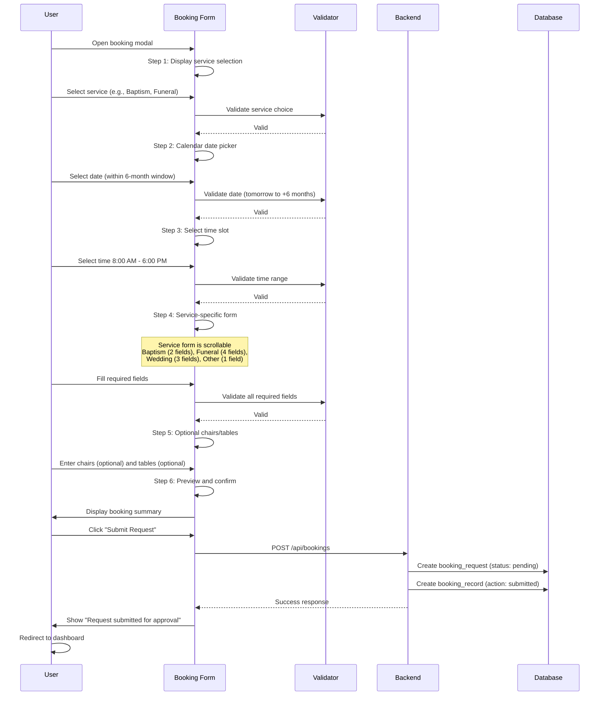

## 17) Admin Approval Workflow

After a member submits a booking request:

1. **Notification**: Admin receives notification of pending request
2. **Review**: Admin views request details in admin dashboard
3. **Decision Points**:
   - **Accept**: Booking becomes confirmed, member notified
   - **Reject**: Request marked rejected, member notified
   - **Edit & Accept**: Admin can modify details (date, time, service) before accepting
4. **Confirmation**: Once accepted, booking appears on member's calendar and in reports
5. **Cancellation**: Member or admin can cancel confirmed bookings anytime

## 18) Notes for the Report

- **Time Validation**: Bookings are restricted to 8:00 AM - 6:00 PM with no 30-minute interval restrictions. Any minute value is allowed within this range (e.g., 8:15 AM, 2:47 PM, 6:00 PM are all valid).
- **Calendar Navigation**: Past months are automatically disabled. Users can only view and book within a dynamic 6-month forward-looking window (tomorrow through 6 months ahead). Month navigation buttons disable gracefully at window boundaries.
- **Booking Request Workflow**: When a user submits a booking form, it creates a pending request that requires admin approval before becoming a confirmed booking. Admins can accept/reject/edit requests from the admin dashboard. Once accepted, the booking is confirmed and the member is notified.
- **Mobile Responsiveness**: The system implements a mobile-first responsive design with 7 key breakpoints (390px, 420px, 520px, 600px, 680px, 900px, 1920px+). Sidebar transforms into a full-screen drawer overlay on mobile with backdrop overlay and body scroll-lock.
- **Responsive Modals**: Booking modals are fully responsive with scrollable content areas and fixed action buttons. Service forms handle 2-4 fields without layout overflow using the flexbox `flex: 1, min-height: 0` pattern.
- **Sidebar Features**: Left sidebar is independently scrollable to ensure contact information (email, phone, Facebook) is always accessible. On mobile, hamburger menu opens drawer with fixed positioning and z-index layering. Right column interaction is disabled while drawer is open.
- **Consistent Card Design**: All white container cards use unified design system: semi-transparent white background, 1px outer border, **3px gold top accent border** (visual signature), rounded corners (responsive: 18px base, 16px @600px, 14px @420px, 12px @390px), and subtle shadows that scale down on mobile.
- **Responsive Grid System**: Dashboard uses conditional `gridTemplateColumns` React state. Desktop (900px+): `repeat(2, 1fr)` two columns. Tablet (600-900px): `1fr` single column (sidebar + main). Mobile (<600px): `1fr` single column with drawer sidebar.
- **Data Storage**: The booking `details` field is stored as JSON and includes chapel selection, service-specific data (couple names for weddings, deceased info for funerals), chairs/tables quantities, and setup notes.
- **Notification System**: Real-time notifications via Socket.IO for all booking actions (new bookings, confirmations, cancellations), proposal responses, and concern status updates.
- **Architecture**: React frontend with responsive hooks (useState, useEffect, useCallback, useMemo) and dynamic resize listeners. Node/Express backend with validation layer enforcing business rules. SQLite database with normalized schema. Components: Dashboard, AdminDashboard, BookingModal (scrollable service form), CalendarViewNew, NotificationCenter, PageWrapper, authenticated routing with role-based access control. Role-based access control includes three roles: member (basic users), admin (can manage bookings and users), superadmin (full access including deleting records and invite codes).
