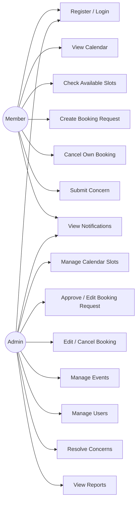
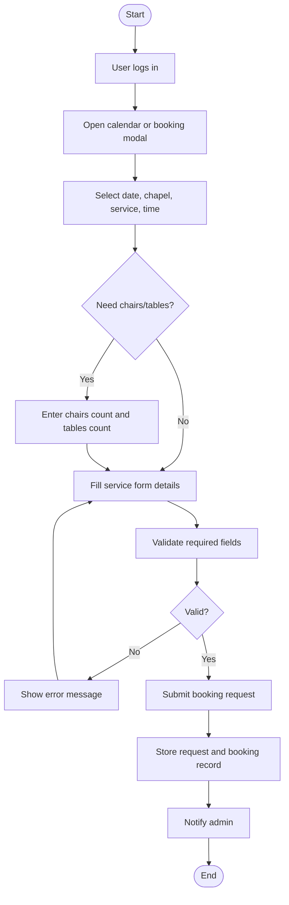
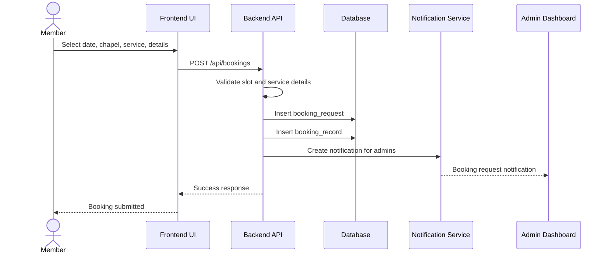
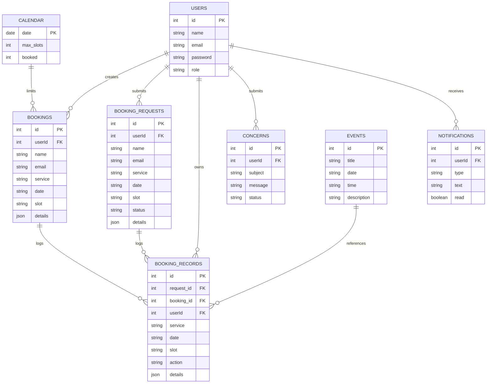
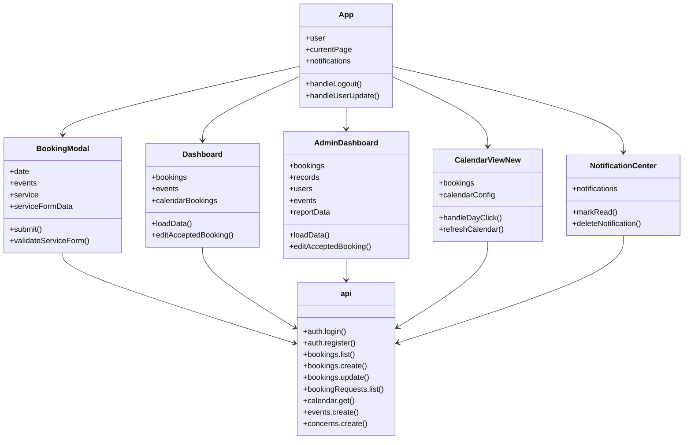
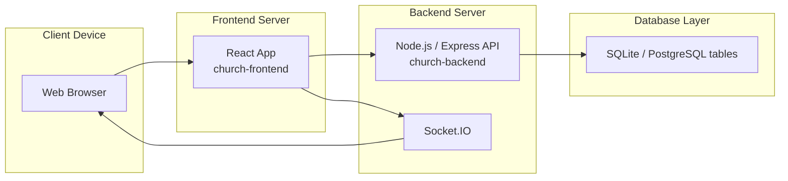

# Church Booking System Diagrams and Algorithms

This document presents the system analysis of the church reservation and management platform based on the current project source code. It is written in a formal style suitable for academic or documentation use.

## How to Use This Document

1. Copy the diagram sections into your report or thesis chapter.
2. If your word processor supports Mermaid, paste the diagram blocks directly.
3. If Mermaid is not supported, convert each diagram into an image using a Mermaid renderer and insert the images into `Diagrams.docx`.
4. Use the algorithm, pseudocode, and notes sections as the written explanation below the diagrams.
5. Keep the diagram titles in your final document so each figure is clearly labeled.

## 1) Use Case Diagram



## 2) Activity Diagram



## 3) Sequence Diagram



## 4) Entity Relationship Diagram



## 5) Class Diagram



## 6) Deployment Diagram



## 7) Algorithmic Process

### A. FCFS Algorithm

1. Accept booking requests in the order they are submitted.
2. Validate the slot, service, and required details.
3. Store valid requests in the booking requests table.
4. Process the earliest pending request first.
5. Check whether the selected date still has available capacity.
6. For exclusive services, verify that the slot is still free.
7. Move approved requests into the confirmed bookings table.
8. Update the calendar booked count.
9. Record the action in booking records.
10. Notify the user and administrator.

### B. Date Color Conditioning Algorithm

1. Read the number of bookings already placed on each date.
2. Read the maximum booking count configured for that date.
3. Assign green if the date has no bookings.
4. Assign yellow if the date is partially occupied.
5. Assign orange if the date is nearing capacity.
6. Assign red if the date is fully booked.
7. Render the calendar cell using the assigned color.
8. Mark closed dates as unavailable.

### C. Date Availability Control Algorithm

1. Admin selects a date in the calendar control panel.
2. Admin sets the maximum booking count for that date.
3. If the maximum count is zero, close the date for bookings.
4. If the maximum count is greater than zero, open the date for bookings.
5. Save the value to the calendar table.
6. Refresh the calendar to show the new availability state.
7. Prevent booking submission when the date is closed or full.

## 8) Pseudocode

### A. FCFS Algorithm

```text
BEGIN
  RECEIVE booking requests in submission order
  FOR each pending request
    VALIDATE slot, service, and required details
    IF request is valid AND date has capacity THEN
      APPROVE request
      MOVE request to confirmed bookings
      UPDATE calendar booked count
      LOG action in booking records
      NOTIFY user and admin
      STOP processing if only one request is being approved
    ENDIF
  END FOR
END
```

### B. Date Color Conditioning Algorithm

```text
BEGIN
  FOR each date in the calendar
    READ booked count
    READ max booking count
    IF date is closed THEN
      SET color to gray
    ELSE IF booked count = 0 THEN
      SET color to green
    ELSE IF booked count is near max THEN
      SET color to orange
    ELSE IF booked count is partially filled THEN
      SET color to yellow
    ELSE IF booked count >= max booking count THEN
      SET color to red
    ENDIF
    RENDER date with selected color
  END FOR
END
```

### C. Date Availability Control Algorithm

```text
BEGIN
  ADMIN selects a date
  ADMIN enters max booking count
  IF max booking count = 0 THEN
    CLOSE date for bookings
  ELSE
    OPEN date for bookings
  ENDIF
  SAVE max booking count in calendar table
  REFRESH calendar display
END
```

## 9) Algorithms

### A. FCFS Algorithm

- Input: booking requests, request order, date capacity
- Output: approved request in first-come-first-served order

Steps:
1. Receive booking requests in the order they are submitted.
2. Validate each request before storage.
3. Queue valid requests as pending.
4. Select the earliest pending request first.
5. Approve it only if the date still has available capacity.
6. Record the approved booking and log the action.

### B. Date Color Conditioning Algorithm

- Input: booked count and maximum booking count
- Output: calendar cell color

Steps:
1. Read the current number of bookings for the date.
2. Read the maximum booking count set by the admin.
3. Use green for empty dates.
4. Use yellow for partially occupied dates.
5. Use orange for dates nearing capacity.
6. Use red for full dates.
7. Use gray or unavailable styling for closed dates.

### C. Date Availability Control Algorithm

- Input: selected date, max booking count
- Output: open or closed availability state

Steps:
1. Admin selects a date in the calendar settings panel.
2. Admin enters the maximum allowed booking count.
3. If the count is zero, set the date to closed.
4. If the count is greater than zero, set the date to open.
5. Save the updated setting to the calendar table.
6. Re-render the calendar to reflect the new state.

## 10) Notes for the Report

- The booking `details` field is stored as JSON and can include chapel, service-specific data, and setup requirements.
- The administrator dashboard now displays chairs and tables directly in the records and reporting sections.
- The system uses a React frontend, a Node/Express backend, and a database layer containing bookings, booking requests, booking records, users, concerns, events, calendar slots, and notifications.
- The diagrams are based on the implemented behavior of the project, not only on abstract requirements.
