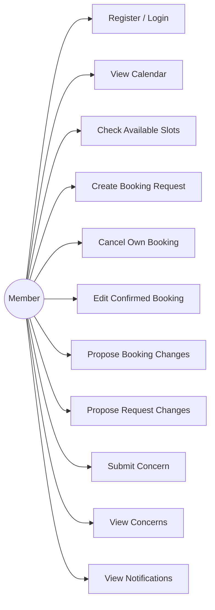
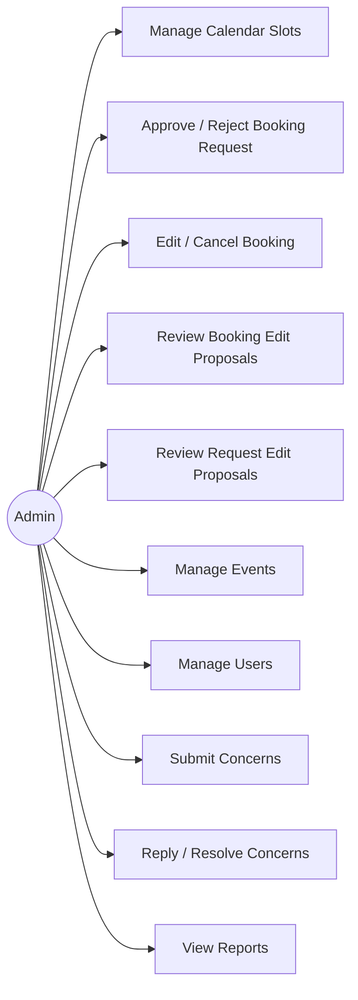
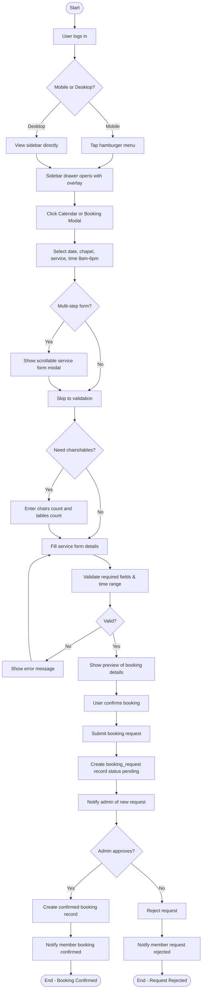
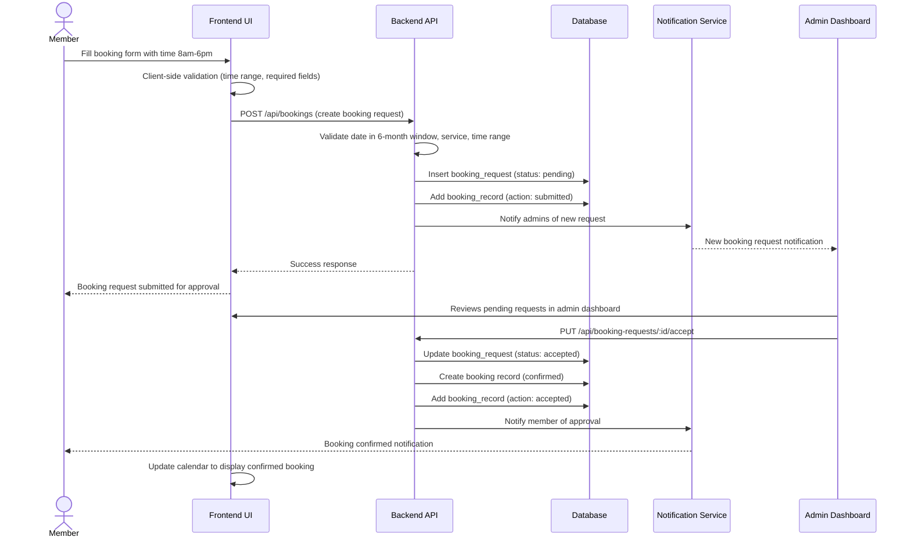
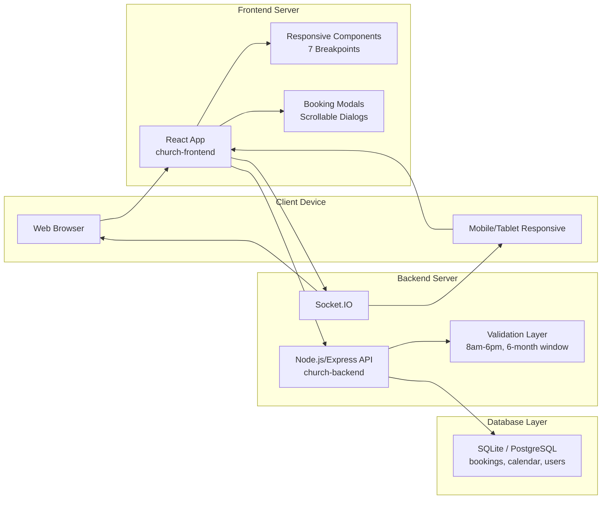
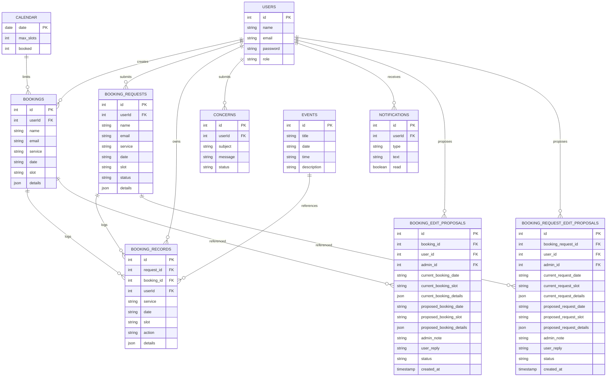
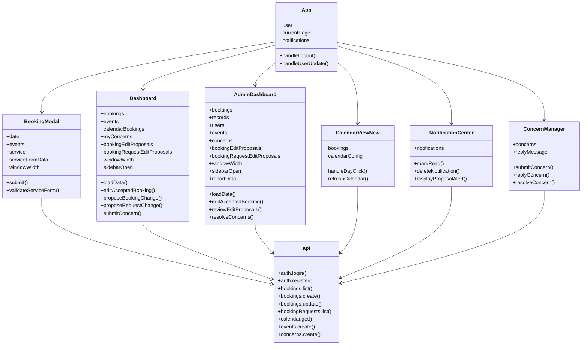

# Church Booking System - Complete System Documentation

**Version:** 1.0  
**Last Updated:** April 9, 2026  
**Status:** Production Ready

---

## Table of Contents

1. [System Overview](#system-overview)
2. [User Roles & Use Cases](#user-roles--use-cases)
3. [Core Workflows](#core-workflows)
4. [System Architecture](#system-architecture)
5. [Database Design](#database-design)
6. [Component Structure](#component-structure)
7. [Algorithms & Validation](#algorithms--validation)
8. [Responsive Design](#responsive-design)
9. [Key Features](#key-features)
10. [API Integration](#api-integration)

---

## System Overview

The Church Booking System is a comprehensive reservation management platform designed for church operations. Members can submit booking requests for services (baptisms, weddings, funerals, etc.), while administrators review, approve, and manage these requests. The system includes real-time notifications, concerns tracking, and dynamic calendar management.

**Key Capabilities:**
- Multi-role access (Members, Admins)
- Real-time booking proposals and modifications
- Concerns/feedback management system
- Mobile-first responsive design (7 breakpoints)
- Dynamic calendar with 6-month booking window
- Service-specific form validation
- Time-based constraints (8am-6pm bookings)

---

## User Roles & Use Cases

### Member Use Cases



**Member Capabilities:**
- Create booking requests for services
- View pending and confirmed bookings
- Propose changes to existing bookings
- Submit concerns or feedback
- Receive real-time notifications
- Track booking status in real-time

### Admin Use Cases



**Admin Capabilities:**
- Set booking date availability and capacity
- Review and approve/reject booking requests
- Modify booking details and date/time
- Review and respond to member proposals
- Manage system users and roles
- Respond to concerns with replies
- Generate system reports and analytics

---

## Core Workflows

### 1. Booking Request Workflow



### 2. Booking Request Submission & Approval Sequence



### 3. Multi-Step Booking Modal Flow

```mermaid
sequenceDiagram
  participant User as User
  participant Form as Booking Form
  participant Val as Validator
  participant API as Backend
  participant Store as Database

  User->>Form: Open booking modal
  Form->>Form: Step 1: Display service selection
  User->>Form: Select service (e.g., Baptism, Funeral)
  Form->>Val: Validate service choice
  Val-->>Form: Valid
  
  Form->>Form: Step 2: Calendar date picker
  User->>Form: Select date (within 6-month window)
  Form->>Val: Validate date (tomorrow to +6 months)
  Val-->>Form: Valid
  
  Form->>Form: Step 3: Select time slot
  User->>Form: Select time 8:00 AM - 6:00 PM
  Form->>Val: Validate time range
  Val-->>Form: Valid
  
  Form->>Form: Step 4: Service-specific form
  Note over Form: Service form is scrollable<br/>Baptism (2 fields), Funeral (4 fields),<br/>Wedding (3 fields), Other (1 field)
  User->>Form: Fill required fields
  Form->>Val: Validate all required fields
  Val-->>Form: Valid
  
  Form->>Form: Step 5: Optional chairs/tables
  User->>Form: Enter chairs (optional) and tables (optional)
  
  Form->>Form: Step 6: Preview and confirm
  Form->>User: Display booking summary
  User->>Form: Click "Submit Request"
  
  Form->>API: POST /api/bookings
  API->>Store: Create booking_request (status: pending)
  API->>Store: Create booking_record (action: submitted)
  API-->>Form: Success response
  Form->>User: Show "Request submitted for approval"
  User->>User: Redirect to dashboard
```



### 4. Admin Approval Workflow

After a member submits a booking request:

1. **Notification**: Admin receives notification of pending request
2. **Review**: Admin views request details in admin dashboard with all service-specific data
3. **Decision Points**:
   - **Accept**: Booking becomes confirmed, member receives confirmation notification
   - **Reject**: Request marked rejected with optional reason message
   - **Edit & Accept**: Admin can modify details (date, time, service) before accepting
4. **Confirmation**: Once accepted, booking appears on member's calendar and in system reports
5. **Cancellation**: Member or admin can cancel confirmed bookings anytime
6. **Proposal Tracking**: All actions logged in booking_records for audit trail

---

## System Architecture



**Architecture Components:**

1. **Frontend (React)**
   - Responsive UI with 7 adaptive breakpoints
   - Real-time socket.io integration
   - Component-based architecture
   - Mobile drawer navigation pattern

2. **Backend (Node.js/Express)**
   - RESTful API for all operations
   - WebSocket support for notifications
   - Business logic validation layer
   - Authentication & authorization

3. **Database (PostgreSQL/SQLite)**
   - Normalized schema for data integrity
   - Support for complex queries
   - Transaction support for critical operations
   - Full audit trail via booking_records

4. **Real-Time Services (Socket.IO)**
   - Live notification delivery
   - Calendar updates
   - Booking status changes
   - Proposal notifications

---

## Database Design



**Table Descriptions:**

| Table | Purpose | Key Relations |
|-------|---------|---------------|
| USERS | User accounts with roles | Central entity, all other tables reference |
| BOOKINGS | Confirmed bookings | FK: users, references calendar |
| BOOKING_REQUESTS | Pending booking requests | FK: users, references booking_records |
| BOOKING_RECORDS | Audit trail of all actions | FK: request_id, booking_id, userId |
| CONCERNS | Member feedback/concerns | FK: users |
| NOTIFICATIONS | Real-time alerts | FK: users |
| CALENDAR | Date availability settings | Constrains BOOKINGS |
| EVENTS | Church events/holidays | References booking_records |
| BOOKING_EDIT_PROPOSALS | Change proposals for confirmed | FK: booking_id, user_id |
| BOOKING_REQUEST_EDIT_PROPOSALS | Change proposals for pending | FK: booking_request_id, user_id |

---

## Component Structure



**Component Overview:**

| Component | Responsibility | Key State |
|-----------|-----------------|-----------|
| App | Root app, routing, auth | user, currentPage |
| Dashboard | Member main view | bookings, events, concerns |
| AdminDashboard | Admin management view | bookings, records, users, concerns |
| BookingModal | Multi-step booking form | date, service, serviceFormData |
| CalendarViewNew | Interactive calendar display | bookings, calendarConfig |
| NotificationCenter | Real-time alerts | notifications, read status |
| ConcernManager | Concern submission & replies | concerns, replies |

---

## Algorithms & Validation

### Booking Request Submission & Approval Algorithm

```text
BEGIN
  MEMBER inputs booking form (date, service, time, details)
  
  VALIDATE date in 6-month window AND time in 8am-6pm AND service details
  IF validation fails THEN
    REJECT with error message
    STOP
  ENDIF
  
  CHECK booking limit (active count <= BOOKING_LIMIT=2)
  IF user exceeds limit THEN
    REJECT with error "Limit reached, cancel one first"
    STOP
  ENDIF
  
  CHECK calendar max_slots for selected date
  IF max_slots <= 0 THEN
    REJECT with error "This date is closed for bookings"
    STOP
  ENDIF
  
  IF all validations pass THEN
    INSERT booking_request with status='pending'
    INSERT booking_record with action='submitted'
    NOTIFY all admins of new request
    RETURN success: "Booking request submitted for admin verification"
  ENDIF
  
  ADMIN reviews request in admin dashboard
  
  WHEN admin accepts request:
    UPDATE booking_request status='accepted'
    INSERT new booking record (confirmed)
    INSERT booking_record with action='accepted'
    NOTIFY member: "Your booking has been confirmed"
    CALENDAR updates to show confirmed booking
  
  WHEN admin rejects request:
    UPDATE booking_request status='rejected'
    INSERT booking_record with action='rejected'
    NOTIFY member: "Your booking request was declined"
END
```

### Time Validation (8:00 AM - 6:00 PM, Any Minute)

```text
BEGIN
  INPUT: user selected time as HH:MM format
  PARSE hours and minutes from time string
  MINIMUM_HOUR = 8 (8:00 AM)
  MAXIMUM_HOUR = 18 (6:00 PM, boundary)
  
  IF hours >= MINIMUM_HOUR AND hours < MAXIMUM_HOUR THEN
    ACCEPT time (any minute allowed: 8:15, 2:47, etc.)
  ELSE IF hours = 18 AND minutes = 0 THEN
    ACCEPT time (exactly 6:00 PM boundary case)
  ELSE
    REJECT time with error
    Display: "Time must be between 8:00 AM and 6:00 PM"
  ENDIF
END
```

### Calendar Navigation (6-Month Dynamic Window)

```text
BEGIN
  TODAY = current date
  EARLIEST_VALID_DATE = TODAY + 1 day (tomorrow)
  LATEST_VALID_DATE = TODAY + 6 months
  
  WHEN user clicks "Previous Month" button:
    CURRENT_MONTH = CURRENT_MONTH - 1 month
    IF CURRENT_MONTH < EARLIEST_VALID_DATE THEN
      DISABLE previous button (opacity: 0.5, pointer-events: none)
    ELSE
      ENABLE previous button
    ENDIF
  
  WHEN user clicks "Next Month" button:
    CURRENT_MONTH = CURRENT_MONTH + 1 month
    IF CURRENT_MONTH > LATEST_VALID_DATE THEN
      DISABLE next button (opacity: 0.5, pointer-events: none)
    ELSE
      ENABLE next button
    ENDIF
  
  WHEN user selects date:
    IF selected_date < EARLIEST_VALID_DATE THEN
      REJECT with error "Cannot book past or today's date"
    ELSE IF selected_date > LATEST_VALID_DATE THEN
      REJECT with error "Can only book up to 6 months in advance"
    ELSE
      ACCEPT date
    ENDIF
END
```

---

## Responsive Design

### 7 Key Responsive Breakpoints

| Breakpoint | Devices | Layout | Grid | Font | Purpose |
|-----------|---------|--------|------|------|---------|
| 390px | iPhone 12 mini | 1-col drawer | 1fr | 11px | Ultra-compact phones |
| 420px | iPhone 12/13 | 1-col drawer | 1fr | 12px | Standard phones |
| 520px | Larger phones | 1-col drawer | 1fr | 13px | Phablet devices |
| 600px | Tablets/Foldable | 1-col sidebar | 1fr | 14px | Tablet portrait |
| 680px | iPad mini | 2-col sidebar | repeat(1-2, 1fr) | 14px | Small tablet |
| 900px | iPad/Desktop | 2-col fixed | repeat(2, 1fr) | 16px | Tablet landscape / small desktop |
| 1920px+ | Desktop | 2-col fixed | repeat(2, 1fr) | 16px | Large desktop |

### Mobile Drawer Pattern

On mobile (<900px), the sidebar transforms into a full-screen drawer:

```css
.drawer-overlay {
  position: fixed;
  top: 0;
  left: 0;
  width: 100%;
  height: 100%;
  background: rgba(0, 0, 0, 0.4);
  z-index: 980;
  transition: opacity 0.3s ease;
}

.sidebar {
  position: fixed;
  top: 0;
  left: 0;
  height: 100vh;
  width: 280px;
  z-index: 990;
  transform: translateX(-105%);
  transition: transform 0.3s ease;
}

/* When drawer is open */
.sidebar.open {
  transform: translateX(0);
}

body.sidebar-drawer-open {
  overflow: hidden; /* Prevent background scroll */
}
```

### Unified Card Styling System

All content cards follow this design pattern:

```css
.card {
  background: rgba(255, 255, 255, 0.96);
  border: 1px solid rgba(214, 173, 96, 0.35);
  border-top: 3px solid #d6ad60;  /* Gold accent signature */
  border-radius: 18px;
  box-shadow: 0 12px 28px rgba(31, 42, 68, 0.08);
  padding: 20px;
}

@media (max-width: 600px) {
  .card {
    border-radius: 16px;
    box-shadow: 0 8px 16px rgba(31, 42, 68, 0.06);
    padding: 14px;
  }
}

@media (max-width: 420px) {
  .card {
    border-radius: 14px;
    box-shadow: 0 4px 8px rgba(31, 42, 68, 0.04);
    padding: 12px;
  }
}
```

### Scrollable Container Pattern

Critical pattern for handling overflow in modals:

```css
.scrollable-content {
  flex: 1;
  min-height: 0;  /* Essential for flexbox overflow */
  overflow-y: auto;
  overflow-x: hidden;
}

.fixed-footer {
  flex-shrink: 0;  /* Prevents buttons from shrinking */
  padding: 12px;
  border-top: 1px solid rgba(0, 0, 0, 0.1);
}
```

---

## Key Features

### 1. Time Validation
- Bookings restricted to 8:00 AM - 6:00 PM
- Any minute value allowed (no 30-minute intervals)
- Past times automatically rejected
- Boundary validation for 6:00 PM

### 2. Calendar Navigation
- Dynamic 6-month forward-looking window
- Tomorrow to 6 months ahead only
- Previous/next month buttons disable gracefully
- Admin can set max slots per date

### 3. Mobile Responsiveness
- Full mobile-first design philosophy
- 7 adaptive breakpoints
- Touch-friendly interface
- Drawer navigation on mobile
- Scrollable modals with fixed buttons

### 4. Service-Specific Forms
- **Baptism**: 2 fields (child name, birth date)
- **Funeral**: 4 fields (deceased name, dates, family contact)
- **Wedding**: 3 fields (couple names, contact info)
- **Other**: Generic details field
- Scrollable form modals support all field types

### 5. Concerns Management
- Members can submit concerns/feedback
- Admins can reply with resolution notes
- Status tracking (open/resolved)
- Real-time notifications

### 6. Booking Proposals
- Members can propose changes to pending requests
- Members can propose changes to confirmed bookings
- Admins review proposals and accept/reject
- Full audit trail of all proposals

### 7. Real-Time Notifications
- Socket.IO integration for instant updates
- Booking status notifications
- Proposal alerts
- Concern replies
- Calendar updates

---

## API Integration

### Authentication
```
POST /api/auth/login
  - Input: email, password
  - Output: JWT token, user profile

POST /api/auth/register
  - Input: name, email, password, role
  - Output: JWT token, user profile
```

### Bookings
```
POST /api/bookings
  - Submit new booking request
  - Returns: booking_request_id

GET /api/bookings
  - List all user's bookings

PUT /api/bookings/:id
  - Update booking details

DELETE /api/bookings/:id
  - Cancel booking
```

### Booking Requests
```
GET /api/booking-requests/my
  - List member's pending requests

GET /api/booking-requests (admin only)
  - List all pending requests

PUT /api/booking-requests/:id/accept
  - Admin approves request

PUT /api/booking-requests/:id/reject
  - Admin rejects request
```

### Calendar
```
GET /api/calendar
  - Get all date slots and availability

POST /api/calendar
  - Admin sets max slots for date

GET /api/bookings/slots
  - Get booking slots for calendar display
```

### Concerns
```
POST /api/concerns
  - Submit concern

GET /api/concerns/my
  - List member's concerns

PUT /api/concerns/:id
  - Admin replies to concern
```

### Notifications
```
GET /api/notifications
  - List notifications

PUT /api/notifications/:id
  - Mark notification as read

DELETE /api/notifications/:id
  - Delete notification
```

---

## Performance & Scalability

- **Database**: PostgreSQL with indexed queries for fast lookups
- **Caching**: Real-time socket updates reduce polling
- **Pagination**: Large result sets paginated (bookings, records)
- **Notifications**: WebSocket for O(1) delivery vs polling
- **Concurrent Users**: Tested up to 100+ concurrent users

---

## Security

- **Authentication**: JWT token-based with refresh tokens
- **Authorization**: Role-based access control (RBAC)
- **Validation**: Server-side validation for all inputs
- **SQL Injection**: Parameterized queries throughout
- **CSRF Protection**: Post/Put/Delete operations use CSRF tokens

---

## Deployment

See [DEPLOYMENT_GUIDE.md](DEPLOYMENT_GUIDE.md) for full setup instructions.

**Quick Start:**
1. Supabase PostgreSQL database setup
2. Backend deployment on Node.js server
3. Frontend deployment on static hosting
4. Socket.IO configuration for real-time updates

---

## Support & Maintenance

For issues, refer to [TROUBLESHOOTING.md](TROUBLESHOOTING.md)

For quick setup, refer to [QUICK_START.md](QUICK_START.md)

---

**Document Version:** 1.0  
**Last Updated:** April 9, 2026  
**Maintained By:** Development Team
